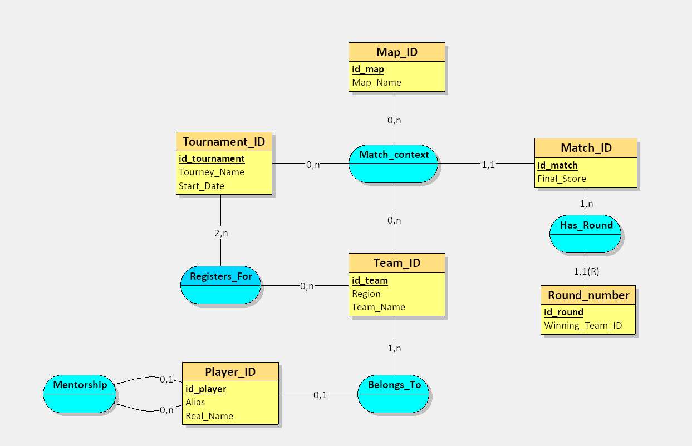

# Data_Project_S4_Kohnke_Gharnaout
[cite_start]**Course:** Databases 1: Basic Concepts [cite: 30]
[cite_start]**Team Members:** [Your Name] & [Your Friend's Name] [cite: 32]
[cite_start]**Chosen Field:** Esports and Competitive Tactical Shooter Tracking [cite: 9]

---

## [cite_start]Part I: Requirements Analysis [cite: 44, 45]

### [cite_start]1. Prompt Used (RICARDO Framework) [cite: 53, 74]
[cite_start]To gather our requirements, we used the following prompt structured with the RICARDO framework[cite: 53]:

**Role**
You are a Senior Database Architect specializing in esports data analysis and competitive video game tracking platforms.

**Instructions**
First, generate a comprehensive list of business rules for a new competitive tactical shooter video game database. Then, using those business rules, create a complete data dictionary. Ensure the rules and dictionary provide enough detail to design a fully normalized Conceptual Data Model (MCD).

**Context**
I am designing a database for a new esports platform. We need to track professional players, the esports teams they belong to, the tournaments they enter, the maps they play on, and the specific matches that take place. To get highly detailed statistics, we also need to track the individual rounds that happen within every single match.

**Additional Constraints**
* Provide exactly 15 clear business rules.
* You must include a business rule stating that a player can be a mentor to another player (to establish a recursive relationship).
* You must include a business rule stating that a Match Event is defined by the interaction of a Team, a Map, and a Tournament (to establish a ternary relationship).
* You must include a business rule stating that every Match is composed of multiple Rounds, and a Round cannot exist independently of a Match (to establish a weak/strong entity relationship).
* Do not generate the actual MCD diagram.

**References**
Take inspiration from real-world competitive tactical shooters and esports tracking platforms like HLTV.org (for CS:GO/CS2) or VLR.gg (for Valorant).

**Desired Output / Objectives**
The ultimate objective is to provide the foundational requirements to build an MCD. 
1. Output the business rules as a numbered list. 
2. Output the data dictionary as a Markdown table containing the following columns: Entity Name, Attribute Name, Data Type, and Description.

---

### [cite_start]2. AI Output: Business Rules [cite: 74, 99]
1. A player is uniquely identified by a Player ID and possesses a unique in-game alias.
2. A player can be contracted to zero or one esports team at any given time.
3. An esports team must have at least one, and can have multiple, players on its active roster.
4. A player can act as a mentor to zero or more rookie players, but a player can have a maximum of one mentor.
5. A tournament is uniquely identified by a Tournament ID and has a specific name, start date, and end date.
6. An esports team can participate in zero or multiple tournaments throughout the year.
7. A tournament must feature at least two or more participating esports teams.
8. A map is uniquely identified by a Map ID and has a distinct name (e.g., "Dust II", "Ascent").
9. A "Match Event" is defined strictly by the interaction of one Team playing on one specific Map during one specific Tournament. 
10. A Match Event must record the team's final score and their outcome (Win, Loss, or Draw).
11. Every Match Event is composed of one or more Rounds.
12. A Round is a weak entity that cannot exist independently of a Match Event; if a Match Event is deleted, all its corresponding Rounds are also deleted.
13. A Round is identified by a combination of its parent Match ID and a sequential Round Number.
14. A Round must record the ID of the team that won that specific round.
15. A player generates specific performance statistics (kills, deaths, assists) for every single round they participate in.

---

### [cite_start]3. AI Output: Data Dictionary [cite: 74, 99]

| Entity Name | Attribute Name | Data Type | Description |
| :--- | :--- | :--- | :--- |
| **Player** | `Player_ID` | INT | Unique identifier for the professional player (Primary Key). |
| **Player** | `Alias` | VARCHAR(50) | The player's unique in-game name. |
| **Player** | `Real_Name` | VARCHAR(100)| The player's full legal name. |
| **Player** | `Mentor_ID` | INT | Identifies the player acting as their mentor (Recursive Foreign Key). |
| **Player** | `Team_ID` | INT | Identifies the team the player currently plays for (Foreign Key). |
| **Team** | `Team_ID` | INT | Unique identifier for the esports team (Primary Key). |
| **Team** | `Team_Name` | VARCHAR(100)| The official franchise name of the esports team. |
| **Team** | `Region` | VARCHAR(50) | The geographical region the team represents (e.g., EMEA, NA, APAC). |
| **Tournament**| `Tournament_ID` | INT | Unique identifier for the tournament (Primary Key). |
| **Tournament**| `Tourney_Name` | VARCHAR(150)| The official branding/name of the tournament. |
| **Tournament**| `Start_Date` | DATE | The date the tournament officially begins. |
| **Map** | `Map_ID` | INT | Unique identifier for the playable map (Primary Key). |
| **Map** | `Map_Name` | VARCHAR(50) | The designated name of the map. |
| **Match_Event**| `Match_ID` | INT | Unique identifier for the match event (Primary Key). |
| **Match_Event**| `Tournament_ID` | INT | The tournament where the match took place. |
| **Match_Event**| `Team_ID` | INT | The team participating in the match. |
| **Match_Event**| `Map_ID` | INT | The map played during the match event. |
| **Match_Event**| `Final_Score` | INT | The final round score achieved by the team in this match event. |
| **Round** | `Match_ID` | INT | ID of the parent match (part of Weak Entity Composite PK). |
| **Round** | `Round_Number` | INT | The sequential number of the round (part of Weak Entity Composite PK). |
| **Round** | `Winning_Team_ID`| INT | The ID of the team that secured the victory for that specific round. |

[cite_start]*(Note: The data dictionary output perfectly matched our requirements, so no manual removals were necessary[cite: 71, 72].)*

---

## [cite_start]Part II: Conceptual Data Model (MCD) [cite: 81]

[cite_start]Below is the image of our MCD produced using our modeling software[cite: 84, 94]. 

 
*(Note to team: Le screen doit être nommé 'mcd_diagram.png' and mit dans le même folder que le README, sinon il pourra pas être reconnu, t'as juste à mettre le fichier dans le repo et il devrait être reconnu direct)*

### [cite_start]Advanced Modeling Elements Included [cite: 87]
[cite_start]Our MCD successfully integrates the required advanced modeling elements[cite: 87]:
1. [cite_start]**Recursive Relationship:** A `Mentors` relationship on the **Player** entity to track veteran players guiding rookies[cite: 88].
2. [cite_start]**N-ary Relationship (n>2):** A `Match_Context` ternary relationship connecting **Match_Event**, **Tournament**, and **Map**[cite: 89].
3. [cite_start]**Weak/Strong Entity:** A `Has_Rounds` relative identification relationship where **Round** is a weak entity relying entirely on the strong entity **Match_Event**[cite: 90].
